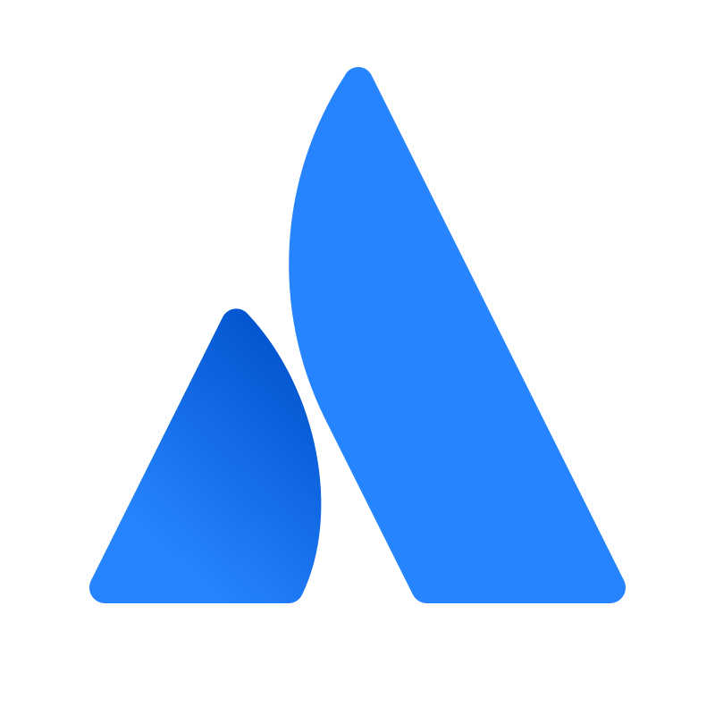

 
 

  
   
  

    
    &nbsp;
    &nbsp;
    &nbsp;
    &nbsp;
    
     
     
     

  

 
 
 

 
 
 
 

<!-- 
## Demo

 -->

 
 
<table>
  <tr>
    <td align="center" width="96">
      
       React
    </td>
    <td align="center" width="96">
      
       NextJs
    </td>
    <td align="center" width="96">
      
       NodeJs
    </td>
    <td align="center" width="96">
      
       CSS
    </td>
    <td align="center" width="96">
      
       HTML
    </td>
    <td align="center" width="96">
      
       Javascript
    </td>
    <td align="center" width="96">
      
       MySql
    </td>
    <td align="center" width="96">
      
       C#&nbsp;(Core)
    </td>
    <td align="center"  width="96">
      
       Tailwind
    </td>
  </tr>
</table>

<table>
  <tr>
    <td align="center" width="96">
      
       Git
    </td>
    <td align="center" width="96">
      
       AWS
    </td>
    <td align="center" width="96">
      
       Jira
    </td>
    <td align="center" width="96">
      
       Blender
    </td>
    <td align="center" width="96"> 
      
       Postman
    </td>
    <td align="center" width="96"> 
      
       Figma
    </td>
  </tr>
</table>

 
 
 

 
 
 
 

 
 

I am a web developer mostly working with React. I mainly build passion projects here, striving to improve my skills every chance I can get. Always looking for a new project idea, with each one challenging me in different ways. I aim to produce quality projects with detailed documentation explaining the project. My other interests in life are digital 3d art, visual effects, cgi and music visualizers.

If you have any questions on one of my repos please do shout and lets start a discussion

 
  

    
  

