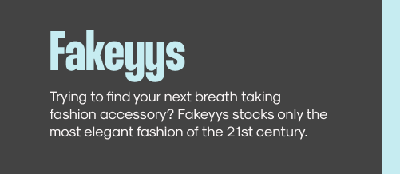

<h3 align="left">Hey there, I'm TypicalLunchbox. (Software Developer)</h3>

Welcome to my Github Profile...You have come to the right place 😀

I am a young developer currently working mostly with Javascript frameworks, but not limited to just that. I am also very passionate/interested in other topics
such as digital art, cgi , visual effects and music visualizers.
*     *     *     *     *     *     *     *     *     *     *     *     *     *     *     *     *     *     *     *     *     *     *     *     *     *     *     *     

Take a look around and see if any of my projects tickle your fancy.
Contact me at keegan.launspach1@hotmail.com for a collboration or if you have any burning questions to how I approach some of my projects. 🐱

<!-- 
## Demo

 -->

<h2 align="left" id="macropower-tech">Favourite Languages and Tools</h2>

> In no particular order.
> 
<table>
  <tr>
    <td align="center" width="96">
      
       React
    </td>
    <td align="center" width="96">
      
       C#&nbsp;(Core)
    </td>
<!--     <td align="center" width="96">
      
       Python
    </td> -->
    <td align="center" width="96">
      
       CSS
    </td>
    <td align="center" width="96">
      
       HTML
    </td>
    <td align="center" width="96">
      
       Javascript
    </td>
    <td align="center" width="96">
      
       MySql
    </td>
    <td align="center" width="96"> 
      
       Postman
    </td>
    <td align="center"  width="96">
      
       Tailwind
    </td>
    <td align="center" width="96"> 
      
       Figma
    </td>
  </tr>
</table>

 
  
<h2>📘 Active Repos</h2>

  <!-- Repo info cards - https://github.com/anuraghazra/github-readme-stats -->
  <!-- Small repo cards (fork) - https://github.com/DenverCoder1/github-readme-stats -->
  

    
    
  

<!-- 
   -->

